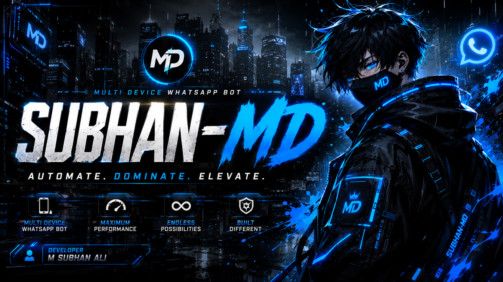

<div align="center">



<br><br>


### 🇵🇰 The Best WhatsApp MD (Multi-Device) Bot — Made In Pakistan

**SUBHAN-MD** is the WhatsApp Multi-Device bot every Pakistani developer is searching for on GitHub — built on **Node.js** and **Baileys** by **M Subhan Ali**. Whether you searched *"MD bot GitHub"*, *"best Pakistan MD bot"*, or *"WhatsApp bot deploy Heroku Railway Render"* — you're in the right repo.

<br>

[](https://github.com/subhanmdofficial/subhan-md/fork)
[](https://github.com/subhanmdofficial/subhan-md)
[](https://github.com/subhanmdofficial/subhan-md/archive/refs/heads/main.zip)
[](https://github.com/subhanmdofficial/subhan-md/issues)

<br>

[](https://heroku.com/deploy?template=https://github.com/subhanmdofficial/subhan-md)
[](https://railway.app/new/template?template=https://github.com/subhanmdofficial/subhan-md)
[](https://render.com/deploy?repo=https://github.com/subhanmdofficial/subhan-md)

<br>


</div>

<br>

---

## 📖 Table of Contents

- [About](#-about-subhan-md)
- [Why SUBHAN-MD?](#-why-subhan-md)
- [Command Categories](#-command-categories)
- [Requirements](#-requirements)
- [Quick Start](#-quick-start)
- [Session Setup](#-session-setup)
- [Configuration](#-configuration)
- [One-Click Deployment](#-one-click-deployment)
- [Storage Backends](#-storage-backends)
- [Plugin System](#-plugin-system)
- [Troubleshooting](#-troubleshooting)
- [Disclaimer](#-disclaimer)
- [License](#-license)

<br>

---

## 🚀 About SUBHAN-MD

**SUBHAN-MD** (𝐒ᴜʙʜᴀɴ-𝐌ᴅ) is a next-generation **WhatsApp Multi-Device (MD) bot**, engineered on **Node.js** and the **Baileys** socket library. It ships with **300+ commands across 19 categories**, an auto-loading plugin architecture, and support for **five storage backends** — from a zero-setup JSON store to full MongoDB, PostgreSQL, MySQL, or SQLite.

It's designed and maintained by **M Subhan Ali** from **Pakistan 🇵🇰**, with one clear goal: give Pakistani (and global) developers the most complete, most reliable WhatsApp MD bot to deploy, extend, and run 24/7.

<div align="center">

| | |
|:---|:---|
| 👤 **Developer** | M Subhan Ali |
| 🌍 **Made In** | Pakistan 🇵🇰 |
| ⚡ **Engine** | Node.js 20+ · Baileys 7.x |
| 🔌 **Commands** | 300+ across 19 categories |
| 🗄️ **Storage** | MongoDB · PostgreSQL · MySQL · SQLite · JSON |
| 📜 **License** | MIT |

</div>

<br>

---

## ⭐ Why SUBHAN-MD?

- 🇵🇰 **Built in Pakistan, built for scale** — actively maintained, production-tested, and tuned for low-RAM hosting.
- ⚡ **Zero-config plugins** — drop a file in `plugins/`, it auto-loads with no manual registration.
- 🗄️ **Any database you want** — JSON works out of the box, or plug in MongoDB, PostgreSQL, MySQL, or SQLite via a single env variable.
- 🛡️ **Serious group protection** — anti-link, anti-spam, anti-bad-word, anti-call, anti-delete, and a full warning system.
- 🤖 **AI built in** — chat commands plus image tools, no third-party bot required.
- 🧩 **Session cloning / bot rental ready** — let others pair their own session off your host.
- 🖥️ **Deploy anywhere** — Heroku, Railway, Render, a VPS, or Termux — pick a button and go.

<br>

---

## 🧩 Command Categories

SUBHAN-MD organizes its 300+ commands into **19 categories**:

<div align="center">

| Category | Focus |
|:---|:---|
| 👑 **Owner** | Bot control — restart, broadcast, session, settings |
| 🛡️ **Admin** | Group moderation — ban, mute, warn, kick, promote |
| 🛠️ **Tools** | Utilities — converters, calculators, generators |
| 📥 **Download** | TikTok, Instagram, Spotify, YouTube, Twitter, and more |
| 🧰 **Utility** | Everyday helper commands |
| 👥 **Group** | Group management and settings |
| ℹ️ **Info** | Lookups — whois, group info, stats |
| 🎨 **Stickers** | Sticker creation, cropping, conversion |
| 💬 **General** | Core, always-on commands |
| ☁️ **Upload** | Media hosting and file uploads |
| 😄 **Fun** | Games, jokes, insults, compliments |
| 🔎 **Stalk** | Social lookups — Instagram, Telegram, GitHub |
| 🖼️ **Images** | Image generation and editing |
| 🎮 **Games** | Hangman, trivia, sudoku, tic-tac-toe |
| 🤖 **AI** | AI chat and image generation |
| 📜 **Quotes** | Quote and status generators |
| 🎵 **Music** | Song search and playback |
| 📋 **Menu** | Command list and help |
| 🔍 **Search** | Wikipedia, dictionary, web lookups |

</div>

Run **`.menu`** (or `.list`) inside WhatsApp any time to see the live, categorized command list.

<br>

---

## ⚙️ Requirements

- **Node.js 20+**
- A WhatsApp account for pairing (a second/spare number is recommended)
- Git (for cloning) — or just download the ZIP
- *(Optional)* MongoDB / PostgreSQL / MySQL if you don't want JSON file storage

<br>

---

## 🏁 Quick Start

```bash
# 1. Clone the repository
git clone https://github.com/subhanmdofficial/subhan-md.git
cd subhan-md

# 2. Install dependencies
npm install

# 3. Configure your environment
cp sample.env .env
# edit .env with your SESSION_ID or PAIRING_NUMBER

# 4. Start the bot
npm start
```

Prefer a QR code instead of a pairing code?

```bash
node index.js --qr-code
```

<br>

---

## 🔑 Session Setup

SUBHAN-MD supports two ways to connect your WhatsApp account:

1. **Pairing Code (recommended)** — set `PAIRING_NUMBER` in your `.env` to your WhatsApp number (with country code, no `+` or spaces). On startup the bot prints an 8-digit code — enter it in **WhatsApp → Linked Devices → Link with phone number**.
2. **Session ID** — generate a session and set it as `SESSION_ID` in your `.env`. Ideal for one-click cloud deployments where you can't watch the terminal.

Never share your `SESSION_ID` publicly — it gives full access to your WhatsApp account.

<br>

---

## 🔧 Configuration

All configuration is handled through environment variables (see `sample.env`):

<div align="center">

| Variable | Description | Default |
|:---|:---|:---|
| `SESSION_ID` | Session credential string | *(empty)* |
| `PAIRING_NUMBER` | Number to receive a pairing code | *(empty)* |
| `BOT_NAME` | Display name of the bot | `𝐒ᴜʙʜᴀɴ-𝐌ᴅ` |
| `BOT_OWNER` | Owner name shown in replies | `ᴍ sᴜʙʜᴀɴ ᴀʟɪ` |
| `OWNER_NUMBER` | Your WhatsApp number | *(empty)* |
| `PREFIXES` | Comma-separated command prefixes | `.,!,/` |
| `COMMAND_MODE` | `public` or `private` | `private` |
| `TIMEZONE` | Bot timezone | `Asia/Karachi` |
| `PORT` | HTTP status server port | `5000` |
| `MONGO_URL` | MongoDB connection string | *(empty)* |
| `POSTGRES_URL` | PostgreSQL connection string | *(empty)* |
| `MYSQL_URL` | MySQL connection string | *(empty)* |
| `DB_URL` | SQLite file path | *(empty)* |
| `REMOVEBG_KEY` | Remove.bg API key | *(empty)* |

</div>

Leave every database variable blank to use the built-in JSON file storage — no setup required.

<br>

---

## ☁️ One-Click Deployment

Pick a platform and hit deploy — SUBHAN-MD ships with ready-made config for all three:

<div align="center">

[](https://heroku.com/deploy?template=https://github.com/subhanmdofficial/subhan-md)
[](https://railway.app/new/template?template=https://github.com/subhanmdofficial/subhan-md)
[](https://render.com/deploy?repo=https://github.com/subhanmdofficial/subhan-md)

</div>

- **Heroku** — uses `app.json` + `heroku.yml` (Node buildpack, `web` dyno running `node index.js`).
- **Railway** — uses `railway.json` (Nixpacks build, auto-restart on failure).
- **Render** — uses `render.yaml` (free web service, `npm install` + `node index.js`).

You can also self-host on any **VPS** or **Termux** — just follow [Quick Start](#-quick-start) above.

<br>

---

## 🗄️ Storage Backends

SUBHAN-MD auto-detects your database from `.env` — no code changes needed:

| Backend | Env Variable | Best For |
|:---|:---|:---|
| **JSON** *(default)* | *(none required)* | Local testing, small deployments |
| **MongoDB** | `MONGO_URL` | Cloud deployments, easy scaling |
| **PostgreSQL** | `POSTGRES_URL` | Relational/self-hosted setups |
| **MySQL** | `MYSQL_URL` | Traditional hosting environments |
| **SQLite** | `DB_URL` | Lightweight local persistence |

<br>

---

## 🧩 Plugin System

Every command lives in its own file inside `plugins/` and exports a single config object:

```js
export default {
    command: 'ban',
    aliases: ['block', 'banuser'],
    category: 'admin',
    description: 'Ban a user from using the bot',
    // handler logic...
};
```

Drop a new `.js` file into `plugins/` following this pattern and it's picked up automatically on the next restart — no manual registration, no editing a master file.

<br>

---

## 🩺 Troubleshooting

| Issue | Fix |
|:---|:---|
| Bot won't pair / QR keeps expiring | Delete the session folder and re-pair fresh |
| High RAM usage on free hosting | Lower `MAX_STORE_MESSAGES` in `.env` |
| Commands not responding | Check `COMMAND_MODE` and your prefix in `PREFIXES` |
| Database not connecting | Double-check the connection string; JSON storage is used automatically if it's blank |

<br>

---

## ⚠️ Disclaimer

This project is **not affiliated with, endorsed by, or officially connected to WhatsApp Inc. or Meta Platforms** in any way. Use it responsibly and in line with WhatsApp's Terms of Service — the developer is not responsible for any account restrictions resulting from misuse.

<br>

---

## 📜 License

Licensed under the **MIT License**. See [`LICENSE`](./LICENSE) for details.

<br>

<div align="center">

**𝐒ᴜʙʜᴀɴ-𝐌ᴅ** — built with 🖤 in Pakistan 🇵🇰 by **M Subhan Ali**

</div>
